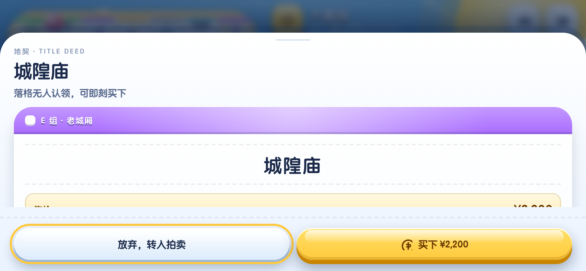
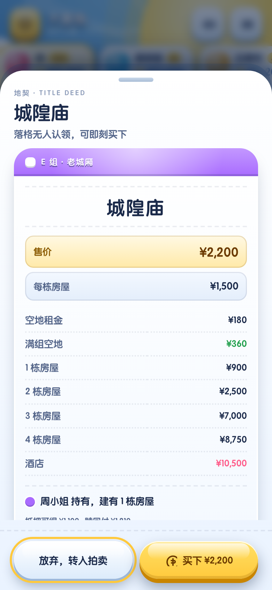
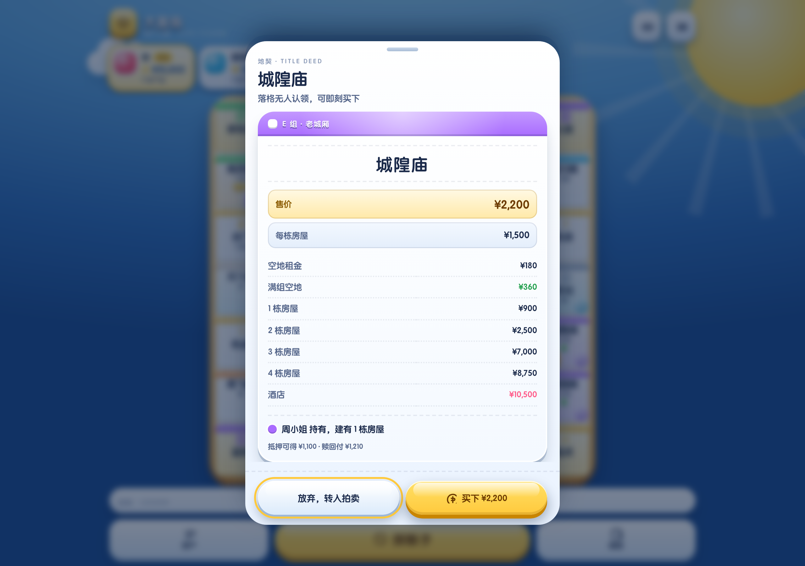

# 大富翁 · 地产小镇

3D 手游风的网页版大富翁，手机竖屏优先，1 人对战 3 个 AI。
纯前端、零依赖、零构建：**双击 `index.html` 就能玩**。

线上：<https://wnzc.github.io/dafuweng/>（push 到 `main` 自动发布）

在手机上打开后可以「添加到主屏幕」，之后全屏运行、断网也能玩。

| 手机竖屏 390×844 | 横屏矮屏 844×390 |
|---|---|
|  |  |

| 地契弹层（手机） | 桌面端（弹层居中） |
|---|---|
|  |  |

## 运行

```bash
# 直接打开
open index.html

# 或者起个静态服务（推荐，localStorage 存档在 file:// 下可能被浏览器禁用）
python3 -m http.server 8765
# → http://127.0.0.1:8765
```

## 玩法与功能

| 模块 | 说明 |
|---|---|
| 掷骰 | 一枚骰子，按点数前进 |
| 移动 | 逐格动画：每格 300ms 一跳、跳完停顿，看清一步一步前进；经过起点领 ¥2,000 |
| 买地 | 落格无人认领可买下；放弃则转入拍卖 |
| 拍卖 | 加价竞拍，AI 按估值上限出价，人类可随时放弃 |
| 租金 | 空地租金 / 满组双倍 / 1–4 栋房屋 / 酒店阶梯 |
| 公用事业 | 持有 1 家骰子 ×80，2 家 ×200；可升级，每级倍率 +50 |
| 车站 | 持有 1–4 座，租金 ¥250→¥2,000；可升级，每级 +¥300 |
| 建造/升级 | 再次停在**自己已买下**的地产/车站/水厂/电厂时，弹窗询问是否升级；最高满级 |
| 抵押 | 抵押得半价，赎回付 110%，有房不可抵押 |
| 监狱 | 缴纳保释金 ¥500 / 出狱许可证 / 掷骰求 6，三回合强制保释 |
| 税收 | 所得税为现金 10%（下限 ¥1,000），罚款进入免费停车场奖池 |
| 卡牌 | 机会 / 命运各 12 张：位移、收付、按房屋收费、全体互付、入狱、出狱证 |
| 破产 | 现金不足时拆房 / 抵押筹款，仍不足则破产，产业转给债主或银行 |
| AI | 买地看现金与满组价值、会建房、会赎回、会参与竞拍 |
| 存档 | 每个回合开始时自动存档，下次可「继续上次对局」 |
| 可安装 | 有 manifest 与各尺寸图标，可「添加到主屏幕」全屏运行 |
| 离线 | Service Worker 预缓存全站（代码 + 样式 + HTML 约 172 KB，图标约 301 KB，合计约 472 KB），断网照常开新局 |
| 分享卡片 | 1200×630 的 OG 图，分享到微信 / 微博 / Twitter 会出大图 |
| 音效 | WebAudio 现场合成（骰子 / 收钱 / 付钱 / 盖章 / 铁门 / 建房 / 胜利），可静音 |
| 反馈 | 震动、浮动金额、盖章特效、战报流水 |
| 无障碍 | 焦点环、aria-label、`prefers-reduced-motion`、`prefers-contrast` |

## 布局

- **手机竖屏**：顶栏（品牌 + 音效/菜单）→ 玩家条（横向滚动，自动滚到当前玩家）→ 棋盘（1:1，`--u = 棋盘边长/100`，格内所有尺寸按 `--u` 缩放）→ 战报面板（吃掉剩余高度）→ 操作坞（资产 / 掷骰子 / 规则）。
- **横屏矮屏**（`orientation: landscape and max-height: 560px`）：棋盘在左，信息与操作在右。
- **桌面 ≥900px**：容器居中，弹层变为居中对话框。
- 棋盘边长由 `ResizeObserver` + 视口高度预算计算，360×640 到 1280×900 都不横滚、不裁切。

## 目录

```
index.html        结构、SVG 图标 sprite、分享卡片与 PWA 元信息
manifest.webmanifest  PWA 清单（standalone、三种图标；不锁方向，横屏布局照常可用）
sw.js             Service Worker：预缓存全站，断网可用
styles.css        设计系统（令牌 → 组件 → 响应式 → 无障碍）
js/data.js        24 格棋盘、卡组、分组、7×7 环坐标
js/audio.js       WebAudio 合成音效
js/engine.js      规则引擎：异步回合循环 + 全部规则 + AI + 存档
js/ui.js          渲染、骰子动画、弹层（地契 / 拍卖 / 筹款 / 资产 / 战报 / 结算）
js/main.js        启动、偏好设置、Service Worker 注册
assets/           应用图标（180 / 192 / 512）与分享卡片 og-cover.jpg
docs/…            设计规格
tools/            开发期脚本（可选，不影响游戏运行）
tools/make-cert.sh  可选：生成本地调试用自签 HTTPS 证书（默认不需要，证书不入库）
```

> `index.html` 里的 `og:image` 与 `canonical` 写的是 Pages 绝对地址。
> 如果换仓库名或换域名，记得同步改这两处，否则分享出去的卡片没有图。
> `node tools/check-pwa.mjs --live` 会盯住这件事：三处地址必须同源，且线上真能取到。

## 发布

push 到 `main` 会先跑测试、再把站点发到 GitHub Pages。**发布目录是白名单**，见
`.github/workflows/static.yml`：

```
index.html  styles.css  sw.js  manifest.webmanifest  js/  assets/
```

只上传这几项，而不是整仓上传。原因是之前用 `path: '.'` 把整个仓库都发布到公网，
连 `.cert/key.pem` 这种本地调试私钥都能被 `curl` 下来——只要某个文件忘了写进
`.gitignore`，它就会自动出现在线上。改成白名单后，默认行为变成「不上线」。

> **代价**：新增**顶层**的运行时文件（比如 `fonts/`、`data.json`）时，必须同时把它加进
> workflow 里那条 `cp -R`，否则线上会 404。`js/` 与 `assets/` 内部新增文件不用管。

## 设计说明

- **方向**：3D 手游风（Monopoly GO 那类）。深蓝天幕 `#1B4E96 → #5FA8E4` + 琥珀棋盘框 `#FFD98A → #E09A33`，高饱和主色金 `#FFC93C` / 粉 `#FF5C8A` / 绿 `#4CD964` / 蓝 `#35C1F0` / 紫 `#A96BFF`。
- **立体语言**：每个可点元素都是「亮面 + 内高光 + 深色立体边 + 投影」的四层结构，按下时下沉到立体边上（`translateY(5px)`）。棋盘用 `padding-box / border-box` 双层渐变做出木框厚度。
- **字体**：圆体（`Yuanti SC` / `ui-rounded`），重量 800–900；关键标题与浮动金额带深色描边（多层 `text-shadow`），这是手游 UI 的典型质感。
- **签名元素**：金币与印章。收钱时一枚金币从格子沿抛物线飞进对应玩家卡片；买地时金色印章弹跳盖下并撒彩带；付租金/缴税时整个界面轻微震屏。
- **动效**（`prefers-reduced-motion` 下全部关闭）：棋盘弹入 + 24 格逐个弹出 · 骰子翻滚落定 · 金币飞入 · 震屏 · 按钮下沉回弹 · 弹层弹簧滑入 · 地契卡 3D 翻转 · 太阳与云朵环境动画。
- **前进节奏**：掷骰落定后停 200ms → 棋子逐格移动，每格 **300ms**（跳跃 260ms + 位移 220ms + 落格小弹跳），一格一跳、跳完再走下一格。
  在「菜单 → 设置 → 动画速度」里可调：慢 464ms / 标准 302ms / 快 178ms 每格。

## 主题文件

- `themes/theme-candy.css` 是上一版「糖果可爱风」的完整样式备份，替换 `styles.css` 即可切回。

## 开发期验证（可选）

### 改完规则先跑回归（推荐）

`engine.js` 没有任何 DOM 依赖，所以可以整套搬到 Node 里跑对局，不需要浏览器：

```bash
node tools/smoke.mjs                 # 默认 12 局 × 400 回合，约 3 秒
node tools/smoke.mjs --games=60      # 加大随机对局数
node tools/smoke.mjs --seed=7        # 复现某组种子
node tools/smoke.mjs --verbose       # 打印每局收尾状态
```

它断言的是**规则不变量**（现金不为负、房屋 0–5 级、地产归属双向一致、破产后资产清空……），
外加一批直接调引擎方法的规则单元断言（租金阶梯、满组翻倍、抵押 110% 赎回、所得税下限、
经过起点发薪、拍卖成交与流拍、卡牌位移、破产清算……），以及「同种子重跑结果一致」的确定性检查。

赢输和数值调整都不会让它误报，但把规则改崩了会立刻红。push 到 `main` 时 CI 会先跑它，跑不过就不发布。

### 改完 PWA / 分享卡自检

```bash
node tools/check-pwa.mjs             # 真开一个浏览器跑，约 10 秒
node tools/check-pwa.mjs --live      # 换成校验线上 Pages（子路径 /dafuweng/ 只有这样才能验到）
node tools/check-pwa.mjs --verbose   # 顺便打印缓存的条目
```

会起一个临时本地服务并逐项断言（42 项）：manifest 能否解析、图标尺寸与声明是否一致、
`og:image` 指向的文件是否真实存在且为 1200×630、`og:image:type` 与真实格式是否对得上、
`canonical` / `og:url` / `og:image` 三处绝对地址是否同源、Service Worker 有没有激活、
`sw.js` 里声明的每个文件是否真的进了缓存，**以及断网重载后能不能真的开出一局**。

push 到 `main` 时 CI 也会跑它（在 ubuntu runner 上真开 Chrome），跑不过就不发布。

### 重新生成分享卡与图标

分享卡里的手机画面是脚本实时打开游戏截的，不是手画的；图标同理：

```bash
node tools/make-og.mjs               # → assets/og-cover.jpg（1200×630，约 137 KB）
node tools/make-icons.mjs            # → assets/icon-192/512、maskable、apple-touch-icon
```

改版式就改 `tools/og-card.html` / `tools/icon.html` 再重跑，中间产物都落在系统临时目录里，不会进仓库。
`make-og.mjs` 会顺手量一遍版式：真机画面（含旋转后的外接矩形）必须完整落在画布内、且不压到金框，
溢出了会直接报错退出——以前靠肉眼看缩略图判断，错判过一次。

### 手机上跑真机

直接起服务即可，**默认纯 HTTP，不需要任何证书**：

```bash
node tools/serve-https.mjs    # → http://<本机IP>:8766
```

存档走 `localStorage`、音效走 WebAudio，都不依赖安全上下文，日常真机调试这样就够了。

只有一种情况才需要 HTTPS——**在 Android 手机上验证震动反馈**。`navigator.vibrate` 要求安全上下文（`http://<局域网IP>` 不算，`http://localhost` 才算），而且只有 Chromium 内核实现了这个 API：iOS / Safari 全系从未实现，在 iPhone 上走 HTTPS 也不会震。这时才生成自签证书：

```bash
bash tools/make-cert.sh       # 自动探测本机所有 IP 写入 SAN；不入库，换网络后重跑
node tools/serve-https.mjs    # 检测到证书就自动切到 https://<本机IP>:8766
```

首次要在手机上安装并信任 `.cert/cert.pem`，换网络或换证书后要重做一次——嫌麻烦就删掉 `.cert/`，服务会自动降级回 HTTP。

### 无人值守驱动 / 截图

```bash
# 需要本地 Chrome + Node 22
python3 -m http.server 8765 &
"/Applications/Google Chrome.app/Contents/MacOS/Google Chrome" --headless=new --no-sandbox \
  --remote-debugging-port=9333 --user-data-dir=/tmp/dc-chrome \
  "http://127.0.0.1:8765/index.html" &

node tools/drive.mjs eval "DC.game.engine.state.round"   # 读状态
node tools/drive.mjs shot out.png 390 844                # 截图
node tools/drive.mjs watch 2000                          # 收集控制台异常
```

`tools/ocr.swift` 是 macOS Vision OCR 小工具，用于在没有视觉模型时读屏幕文字（编译产物 `tools/bin/` 不入库）：

```bash
swiftc -module-cache-path ./tools/.mcache -o tools/bin/ocr tools/ocr.swift
./tools/bin/ocr out.png 0.3
```

## 许可

[MIT](LICENSE)
